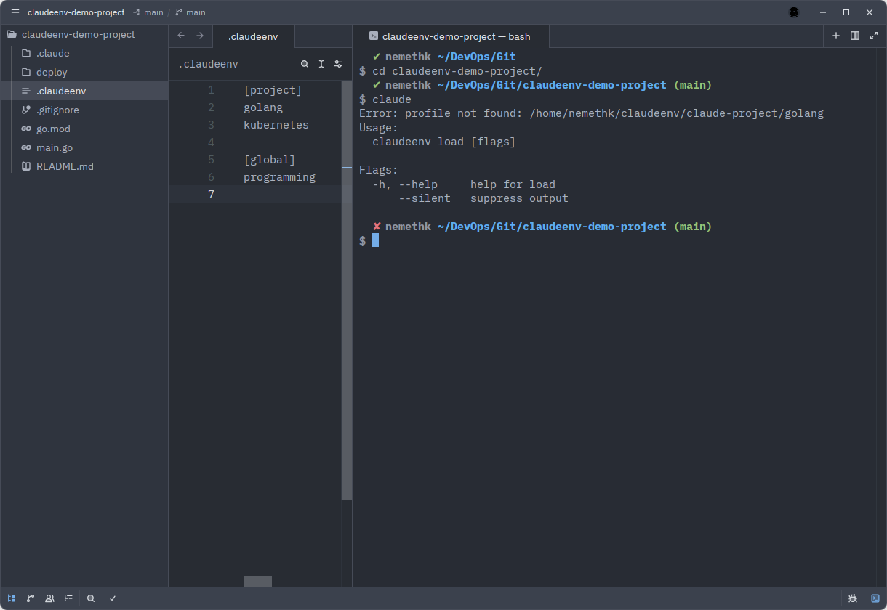
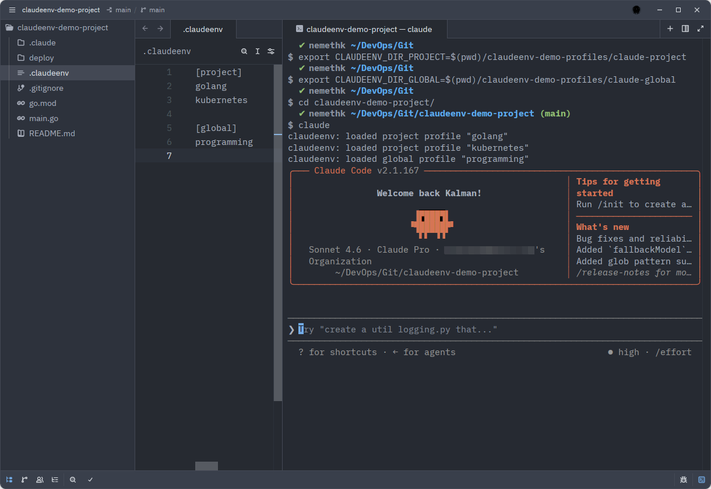
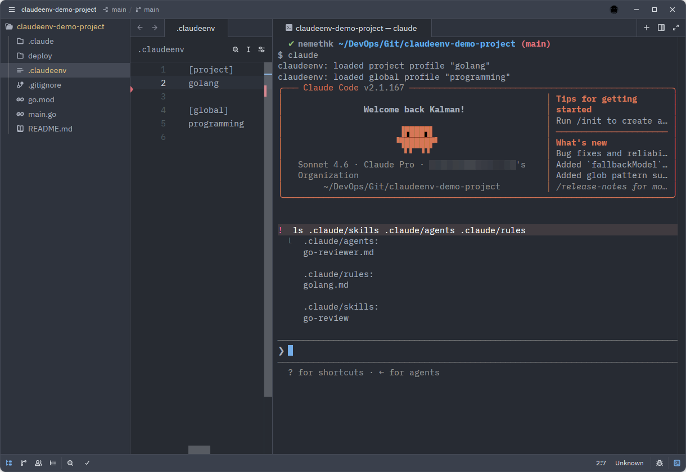
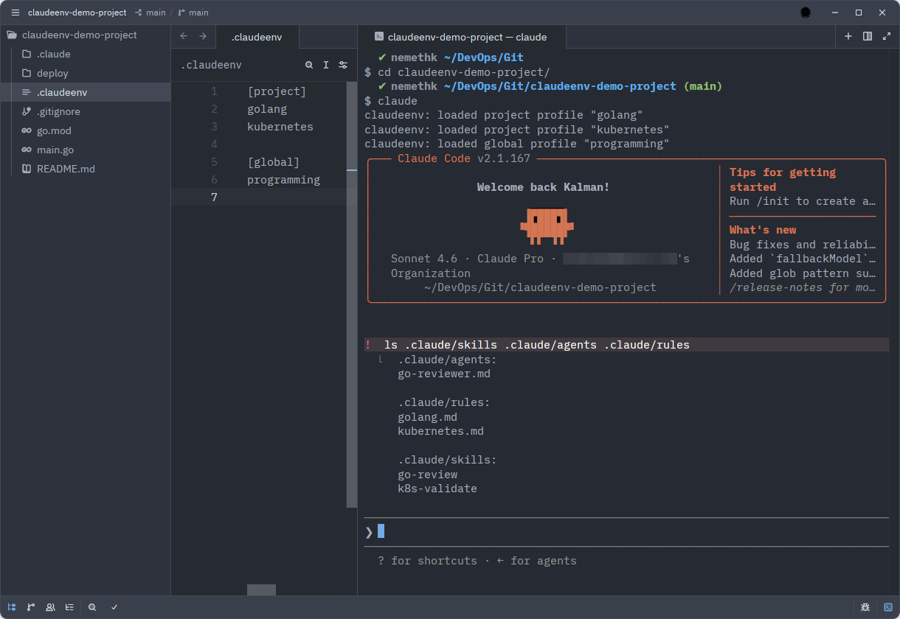
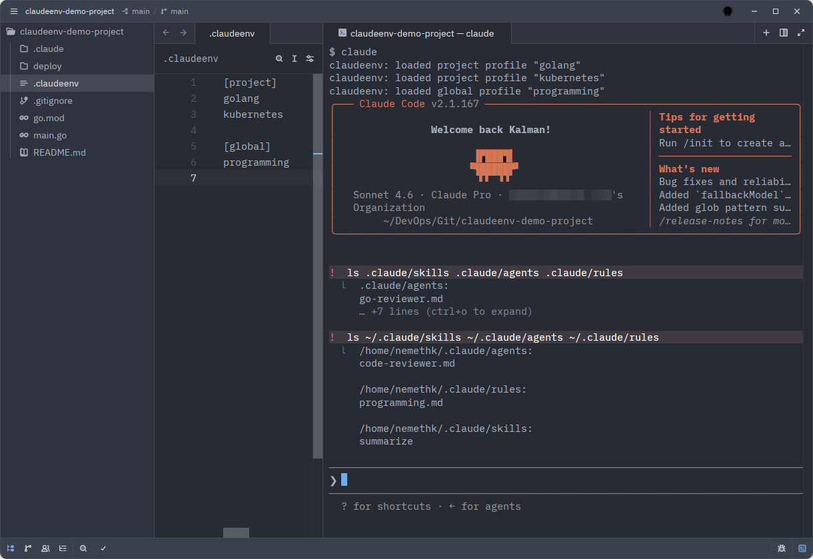

# claudeenv: A pyenv-Style Environment Manager for Claude Code

## Two problems with Claude Code at scale — and one tool that fixes both

---

If you use Claude Code across more than one type of project, you have probably noticed the drift. Open a Go service and the skill list includes finance helpers. Switch to a Kubernetes repo and ETF analysis tools are still there. The more you extend Claude Code, the more every session looks the same regardless of what you are actually working on.

This is not just a cosmetic problem. It is a context leakage problem — and it gets worse at scale.

Now flip it around. You work on ten Go repositories. Every one needs the same review skill, the same rules, the same agent — so you copy them into each repo by hand and try to keep them in sync as they evolve.

Two different problems. Both caused by the same missing primitive: there is no way to declare and manage Claude Code context at the project level.

---

## The Real Cost of Unscoped AI Context

Claude Code is extensible — through **skills**, **agents**, **rules**, and more. That flexibility is what makes it genuinely useful across domains. But there is a catch: out of the box, everything you configure is globally visible in every session.

Rules are the most consequential part of this. Rules are loaded into the context window at session start. Every rule that does not belong to the current task still occupies context, forces Claude to mentally filter around it, and consumes tokens on every invocation. A Go microservice loading finance rules and ETF instructions is burning working context on noise — and weakening Claude's domain focus in the process.

For a single session, the impact looks minor. Across dozens of sessions per day, across a team, across automated pipelines that invoke Claude many times per run, it compounds into a real operational cost.

There is no native mechanism to say: *"in this repository, load only the context that belongs here."*

That is the first problem `claudeenv` was built to solve.

---

## The Second Problem: Write Once, Load Everywhere

Context leakage is the visibility problem. But there is a second problem that hits anyone working across multiple projects in the same domain: **duplication**.

Suppose you work on five Go repositories. Each one needs the same `go-review` skill, the same `golang.md` rules, and the same code-reviewer agent. Without `claudeenv`, you copy those files into every single `.claude/` directory. Five repos, five copies, manually kept in sync.

Update the rules in one place and the other four are immediately stale. Improve the skill prompt and now you have to remember which repos have the old version. The more projects, the more copies. The more copies, the more drift.

```
payment-service/.claude/skills/go-review/   ← copy
auth-service/.claude/skills/go-review/      ← copy
api-gateway/.claude/skills/go-review/       ← copy
user-service/.claude/skills/go-review/      ← copy
```

With `claudeenv`, the profile lives in one place. Every repository that declares `golang` under `[project]` in its `.claudeenv` points at the same source via symlinks — there is nothing to copy and nothing to drift.

```
my-claude-profiles/claude-project/golang/skills/go-review/   ← one source

payment-service/.claude/skills/go-review → (symlink)
auth-service/.claude/skills/go-review    → (symlink)
api-gateway/.claude/skills/go-review     → (symlink)
user-service/.claude/skills/go-review    → (symlink)
```

Update the skill once, and every project picks it up the next time `claude` runs. No copying, no synchronization, no forgotten repos carrying a stale version.

---

## What Is claudeenv?

`claudeenv` is a pyenv-style environment manager for Claude Code. It activates a repository-specific set of skills, agents, and rules before each Claude session — and clears the previous ones — so Claude starts with exactly the context the current codebase requires.

The mental model is intentionally borrowed from tools engineers already know:

| Tool | File | What it switches |
|------|------|-----------------|
| `pyenv` | `.python-version` | Python runtime version |
| `goenv` | `.go-version` | Go runtime version |
| `claudeenv` | `.claudeenv` | Claude Code profile |

The only difference is what gets switched. Instead of language runtimes, `claudeenv` switches AI context.

Each project declares its profile in a `.claudeenv` file committed to the repository:

```ini
[project]
golang
kubernetes
```

Each developer sets their personal global profile once per machine:

```bash
claudeenv global use programming
```

When you run `claude`, `claudeenv` reads `.claudeenv`, symlinks the matching profile's `skills/`, `agents/`, and `rules/` directories into `.claude/`, merges in the personal global profile, and removes what was there before. The result is immediate:

```bash
cd ~/work/payment-service
claude
# claudeenv: loaded project profile "golang"
# claudeenv: loaded project profile "kubernetes"
# claudeenv: loaded global profile "programming"

cd ~/work/etf-dashboard
claude
# claudeenv: loaded project profile "etf"
# claudeenv: loaded global profile "finance"
```

No flags. No manual steps. Just `cd` and run.

---

## How It Works

### Two Independent Layers

`claudeenv` manages Claude Code configuration at two levels.

**Project profiles** are repository-specific. They define domain context — `golang`, `kubernetes`, `security`, `docs`, `etf`. These are declared in `.claudeenv`, which should be committed to the repository. Every teammate who clones the repo gets the same project-level Claude context automatically.

**Global profiles** are personal. They describe your role or working style — `programming`, `engineering`, `finance`. These are set per developer with `claudeenv global use` and are not committed to the repository — each person's machine carries their own.

```bash
# set project profile for the current repo
claudeenv project use golang
claudeenv project add kubernetes

# set your personal global profile (once per machine)
claudeenv global use programming
```

### Profiles Are Just Directories

All profiles live in ordinary directories with a predictable structure:

```
my-claude-profiles/
├── claude-global/
│   ├── programming/
│   │   ├── skills/
│   │   ├── agents/
│   │   └── rules/
│   └── finance/
└── claude-project/
    ├── golang/
    │   ├── skills/
    │   │   ├── go-review/SKILL.md
    │   │   └── go-bench/SKILL.md
    │   ├── agents/
    │   │   └── go-agent.md
    │   └── rules/
    │       └── golang.md
    ├── kubernetes/
    └── etf/
```

You point `claudeenv` at those directories with two environment variables:

```bash
export CLAUDEENV_DIR_GLOBAL=~/my-claude-profiles/claude-global
export CLAUDEENV_DIR_PROJECT=~/my-claude-profiles/claude-project
```

Global and project profiles can live in **different repos** — personal profiles in a private repo, team profiles in a shared org repo. Each person clones wherever they prefer and sets the env vars once in their shell config.

### One-Time Shell Integration

```bash
eval "$(claudeenv init)"
```

Add that to `~/.bashrc` or `~/.zshrc` and reload. This wraps the `claude` command: every time you type `claude`, `claudeenv` fires first, reads `.claudeenv`, and loads the right profile before Claude Code starts.

At this point, if you run `claude` before setting the profile directory env vars, you will see something like this:



This is not a misconfiguration — it is useful feedback. The shell integration is working: `claudeenv` read `.claudeenv`, found the `golang` declaration, and tried to locate the profile. It failed because `CLAUDEENV_DIR_PROJECT` still points to the default path where no profiles exist yet. The error tells you exactly what to fix.

Once you export the env vars pointing to your profiles repo:

```bash
export CLAUDEENV_DIR_PROJECT=~/my-claude-profiles/claude-project
export CLAUDEENV_DIR_GLOBAL=~/my-claude-profiles/claude-global
```

Running `claude` again produces this instead:



Three output lines before Claude Code's welcome screen — one per loaded profile. From this point on, every `claude` session in this repository starts with exactly this context and nothing else.

The profile state is also dynamic — edit `.claudeenv`, reload, and `claudeenv` atomically removes the old symlinks and creates the new ones. Nothing is left over from the previous state. In the example below, `kubernetes` was removed from the project profile list: after reloading, its skills and rules are gone from `.claude/` while everything else stays intact.



---

## The `.claudeenv` File Is the Contract

The most important design principle behind `claudeenv` is where `.claudeenv` lives: committed to the repository, alongside the code.

That makes it a contract between the codebase and Claude Code. Whoever clones the repo — a teammate, a CI job, a new hire on day one — gets the declared Claude context automatically. No onboarding steps, no remembered flags, no configuration drift.

For personal overrides without touching the shared file, `claudeenv` supports `.claudeenv.local`, which is gitignored:

```ini
# override global profile for this project only
[global]
finance

# add a profile on top of the team's default (+ prefix required)
[project]
+etf
```

The behavior is intentionally constrained:

- `[global]` in `.claudeenv.local` **replaces** the team default — it is a personal choice that does not affect others
- `[project]` in `.claudeenv.local` is **additive only** — the `+` prefix is what signals this intent; lines without it are silently ignored

This design matters. It gives individuals room for personal variation without allowing silent divergence from the shared contract.

---

## Real-World Scenarios

### Scenario 1: Multi-Domain Engineering Team

Consider a small team:

- **Alice and Bob** — backend engineers on Go microservices and Kubernetes
- **Carol** — data analyst working on ETF research

Without `claudeenv`, everyone sees every skill in every session. Go tools appear in Carol's finance work. ETF analyzers show up in Alice's backend code.

With `claudeenv`, Alice commits `.claudeenv` to the payment service repo:

```ini
[project]
golang
kubernetes
```

Bob clones the repo. The `.claudeenv` is already there. He runs `claude` — Go and Kubernetes profiles load automatically. He never thinks about setup.

Carol's ETF dashboard repo declares:

```ini
[project]
etf
```

Each person sets their own global profile once:

```bash
# Alice and Bob
claudeenv global use engineering

# Carol
claudeenv global use finance
```

After Claude Code starts, you can inspect exactly what was loaded. Running `! ls .claude/skills .claude/agents .claude/rules` from inside Claude Code lists the symlinked contents of the project profile:



The project profile brought in the `go-reviewer` agent, `golang.md` and `kubernetes.md` rules, and the `go-review` and `k8s-validate` skills — nothing from ETF, finance, or any other domain.

The global profile is independent and lives in `~/.claude/`. Running `! ls ~/.claude/skills ~/.claude/agents ~/.claude/rules` shows what it contributed:



The `programming` global profile added a `code-reviewer` agent, `programming.md` rules, and a `summarize` skill. Project and global profiles are completely separate namespaces — each person's global profile layers on top of the shared project context without interfering with it.

Alice sees only engineering tools. Carol sees only finance tools. The environment follows the repository — not each person's memory of what should be active.

### Scenario 2: A/B Testing Skills and Rules

This use case is easy to overlook: **building and iterating on Claude Code skills**.

If you are developing a `go-review` skill and want to compare two versions against the same codebase, maintain each variant as a separate profile:

```
claude-project/
├── go-review-v1/
│   └── skills/go-review/SKILL.md   # current stable version
├── go-review-v2/
│   └── skills/go-review/SKILL.md   # experimental rewrite
└── golang/
    └── rules/golang.md
```

Switch between them on the same codebase:

```bash
claudeenv project use golang
claudeenv project add go-review-v1
claude   # observe v1 behaviour

claudeenv project use golang
claudeenv project add go-review-v2
claude   # observe v2 behaviour — same repo, same code, different skill
```

Each `claudeenv project use` call clears the previous symlinks and loads the new set. No manual file editing, no losing track of which version is active. The development loop becomes: write → profile → test → compare → promote to stable.

The same approach works for tuning rules. Maintain `rules-strict` and `rules-permissive` as separate profiles and switch between them to compare Claude's behavior systematically.

### Scenario 3: Reproducible AI Context in CI/CD

This is where `claudeenv` becomes more than a personal productivity tool.

If Claude Code participates in your automation — pull request review, security scanning, documentation generation, release preparation — you need that automation to have the same disciplined context your developers have. Without it, pipelines either load everything (noisy, expensive) or nothing (no domain focus).

Because `.claudeenv` is committed to the repository, CI inherits the correct Claude configuration automatically on clone. A pipeline only needs access to the profiles repo and a single load step:

```yaml
- name: Set up claudeenv profiles
  run: |
    git clone git@github.com:org/claude-profiles.git ~/profiles
    export CLAUDEENV_DIR_PROJECT=~/profiles/claude-project
    export CLAUDEENV_DIR_GLOBAL=~/profiles/claude-global
    claudeenv load
```

Different pipeline stages can load different profiles by stacking them:

| Stage | Profile | What loads |
|-------|---------|------------|
| PR review | `code-review` | review agents, style rules |
| Security scan | `security` | OWASP-focused rules |
| Docs | `docs` | documentation skills |
| Release | `release` | changelog skill, checklist |

The profile is versioned alongside the code. When the project evolves, the Claude context evolves with it — automatically, without anyone updating pipeline configuration.

---

## Security Guardrails

`claudeenv` validates profile names against a strict pattern — alphanumeric characters, underscores, and hyphens only. This blocks path traversal attacks via malicious `.claudeenv` files.

There is also a deliberate constraint on global directory overrides: `[global.dir]` (which lets you point to a custom global profiles directory) is honored only in `.claudeenv.local`, never in the committed `.claudeenv`. A repository cannot silently redirect a teammate's global profile to an arbitrary path.

Infrastructure tools should make the safe path the default path.

---

## Getting Started

**Install:**

```bash
# curl (recommended)
curl -fsSL https://raw.githubusercontent.com/nemethk/claudeenv/main/scripts/install.sh | bash

# Homebrew
brew install nemethk/tap/claudeenv

# Go
GOBIN=/usr/local/bin go install github.com/nemethk/claudeenv@latest
```

**Shell integration (one time):**

```bash
echo 'eval "$(claudeenv init)"' >> ~/.zshrc
source ~/.zshrc
```

**Set up your first project:**

```bash
cd ~/your-project
claudeenv project use golang
git add .claudeenv
git commit -m "add claudeenv profile"
```

**Create a new profile:**

```bash
claudeenv new golang
# scaffolds ~/claudeenv/claude-project/golang/ with skills/, agents/, rules/
```

Want to try it without configuring anything? Clone the demo repos — they already contain `.claudeenv` and matching profiles:

```bash
git clone https://github.com/nemethk/claudeenv-demo-profiles.git ~/claudeenv-demo-profiles
git clone https://github.com/nemethk/claudeenv-demo-project.git ~/claudeenv-demo-project

export CLAUDEENV_DIR_PROJECT=~/claudeenv-demo-profiles/claude-project
export CLAUDEENV_DIR_GLOBAL=~/claudeenv-demo-profiles/claude-global

cd ~/claudeenv-demo-project
claudeenv load
```

---

## What Is Next

The tool is functional, tested, and in active use. Upcoming work includes:

- **Auto-detection** — infer the profile from project files (`go.mod` → golang, `Chart.yaml` → kubernetes)
- **Community profiles registry** — share and discover profiles
- **Windows support**

---

## Closing Thoughts

The strongest developer tools do not just add capability — they reduce ambiguity. `claudeenv` applies an old and proven idea from language tooling to AI-assisted engineering:

- Declare the intended environment once
- Store skills, agents, and rules in one place — not copied into every repo
- Version the configuration with the repository
- Load it automatically when work begins

As AI tools become more integrated into delivery workflows, context management stops being a convenience issue and becomes an engineering concern. Teams need the equivalent of environment management for prompts, rules, skills, and automation behavior. The patterns are already there from `pyenv`, `goenv`, and `direnv` — `claudeenv` extends them to Claude Code.

One file per project. One command to set up. Automatic loading on every session.

The project is open source and MIT licensed — source, docs, and installation at [github.com/nemethk/claudeenv](https://github.com/nemethk/claudeenv).

If you work with Claude Code, have ideas for profiles, or want to collaborate on the tooling — I'd love to connect and discuss.

---

*Kalman Nemeth — AI Infrastructure Engineer · [LinkedIn](https://www.linkedin.com/in/nemethkalman/)*
